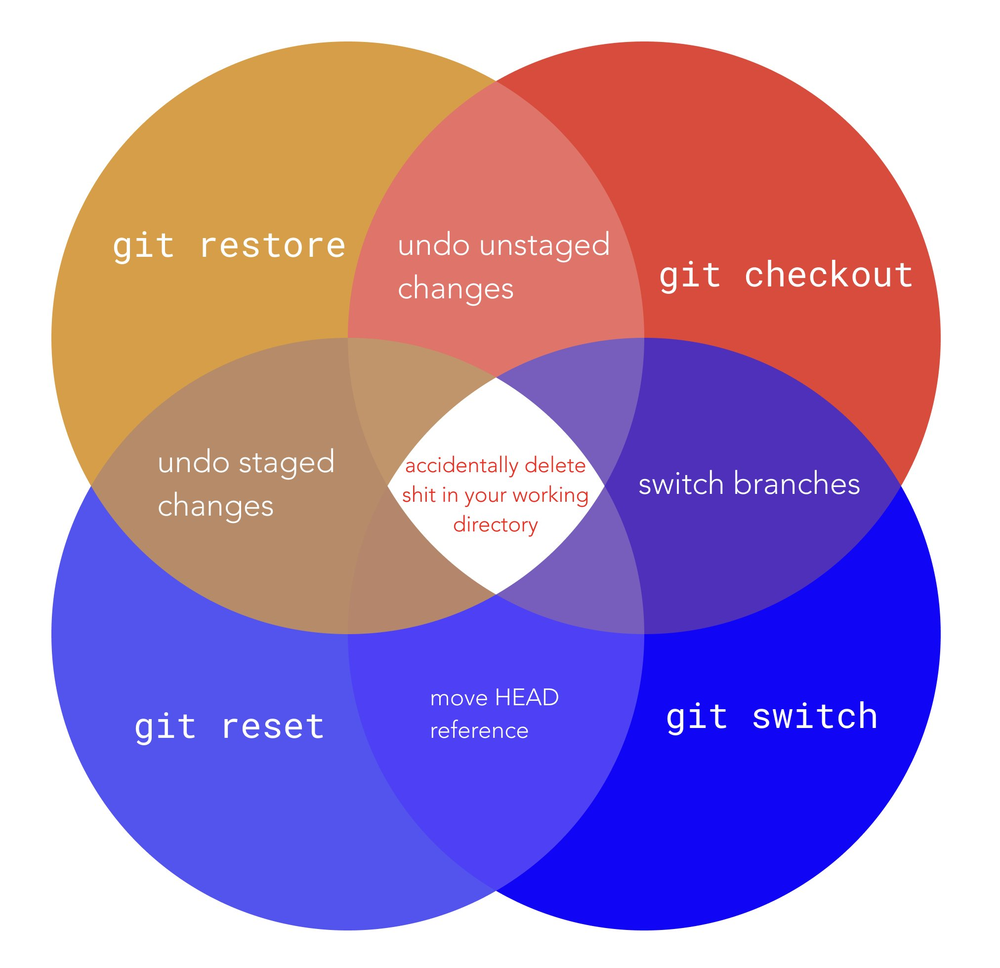

# lineares VC - git-tag
`git tag` - Erstellt, löscht und listet Tags.

* `git tag <name> [<commit>]`: erstellt einen neuen commit
* `git tag -l [<pattern>]`: listet commits, die pattern entsprechen
* `git tag -d <name>`: löscht einen tag

::: notes
* unterscheidung zwischen 'annotated' und 'lightweight' tags: annotated haben nachricht und können signiert (und verifiziert) werden -> releases, lightweight sind nur benannte referenz auf commit -> interne nutzung
* annotated tags über -a, message -m, signed -s
:::
# lineares VC - git-blame
`git blame <file>` - zeigt für jede Zeile an, wer diese zuletzt bearbeitet hat

Optionen:

* `-L <hunk>`: begrenzt die Ausgabe auf einen Bereich
* `-w`: ignoriert Whitespace-Änderungen
* `-C`: ignoriert Commits, in denen die Zeile nur verschoben und nicht geändert wurde

::: notes
* `-L`: analog zu `git log -L`
* `-C`: bis zu dreimal angeben um mehr Commits zu durchsuchen
:::

# lineares VC - git-config
`git config` - Konfiguration von git

Verschiedene Unterbefehle:

* `git config get <key>`: liest einen Wert
* `git config list`: zeigt alle Werte
* `git config set <key> <value>`: setzt einen Wert

Optionen:

* `--global`: betrachtet globale Einstellungen

::: notes
* key-value-pairs, kein schutz vor rechtschreibfehlern
* global -> für den nutzer, default ist --local -> repository spezifisch
:::
<!-- undo -->
# lineares VC - Änderungen Rückgängig machen

# lineares VC - git-reset
`git reset [<commit>] <path...>` - setzt den Stand der angegeben Pfade im Index auf den Stand im angegebenen Commit zurück

Optionen:

* `-p` `--patch`: um interaktiv Änderungen auszuwählen

::: notes
* undo git add: set files in index to state of earlier commits (default HEAD)
:::

# lineares VC - git-reset
`git reset [<mode>] [<commit>]` - Ändert HEAD auf `<commit>`

Modi:

* `--soft`: lässt Index und Working Tree unverändert
* `--mixed`: (default) ändert Index, aber nicht Working Tree
* `--hard`: ändert Index und Working Tree
* `--keep`: wie `--hard`, behält lokale Änderungen bei

::: notes
* --keep: Working Tree wird geändert für alle Dateien mit Differenz HEAD <> commit, wenn lokale Änderungen --> Abbruch
:::

# lineares VC - git-restore
`git restore <path...>` - Setzt Dateien im Working Tree auf eine frühere Version zurück

Quelle:

* Option `--source=<commit>`
* HEAD, falls `--staged` angegeben ist
* sonst Index

# lineares VC - git-restore
Optionen:

* `-S` `--staged`: Ändert auch den Index
* `-W` `--worktree`: Ändert den Working Tree
* `-p` `--patch`: interaktive Auswahl der Änderungen
* `--source=<commit>`: andere Quelle

::: notes
* -S -W kann genutzt werden, um Index und Working Tree rückgängig zu machen
:::

# lineares VC - git-revert
`git revert <commit...>` - macht Commits rückgängig

Optionen:

* `-n` `--no-commit`: ändert Index und Working Tree, erzeugt jedoch keinen Commit
* während der Ausführung: `--continue` | `--skip` | `--quit` | `--abort`

::: notes
* erfordert cleanen Working Tree (keine Änderungen zu HEAD)
* erzeugt neue Commits, die die Änderungen der angegebene Rückgängig machen
* --continue macht mit nächstem commit weiter
* --skip überspringt commit
* --quit gegenteil von --continue
* --abort abbruch, macht alle änderungen dieses befehls rückgängig 
:::

<!-- stash -->
# lineares VC - git-stash
`git stash` - verwaltet unversionierte Änderungen

Subcommands:

* `list`: listet Einträge
* `show [<stash>]`: zeigt Änderungen in einem Eintrag
* `push` (default): erzeugt einen neuen Eintrag
* `apply [<stash>]`: wendet einen Eintrag auf den Working Tree an

# lineares VC - git-stash
Subcommands:

* `drop [<stash>]`: löscht einen Eintrag
* `pop [<stash>]`: wie `apply` + `drop`

::: notes
* ein stash speichert Änderungen von Index + Working Tree relativ zu HEAD
* sind commits, die nicht in der Historie vorkommen
* spezielle Referenz stash, angabe über stash@{&lt;num&gt;} oder nur zahl
* wenn keine angabe -> neuster stash
* push: Änderungen werden weggespeichert, danach wird Index + Working Tree auf HEAD zurückgesetzt
* pop / apply: wendet gespeicherte änderungen auf working tree an
* kann fehlschlagen (HEAD hat sich geändert) -> merge conflict muss resolved werden -> stash wird nicht gelöscht
* git stash clear um alle zu löschen
* git push -m &lt;msg&gt; um aussagekräftigere Nachricht zu setzen
:::
