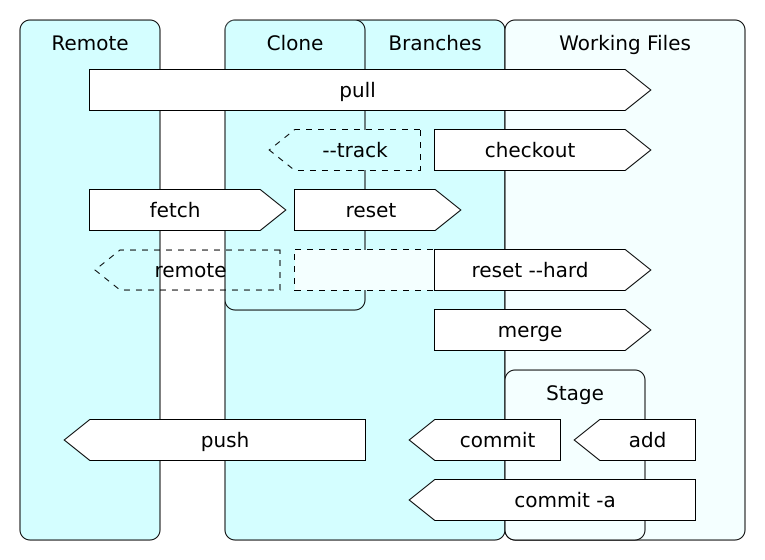

% Git
% Mathieu de Montmollin, Bernhard Lindner
% 09.10.2024
::: notes
Begrüsung
:::

# Reinfolge

1. Geschichte
2. Technische Grundlagen
3. Vorbereitung
4. Lineares VC
5. Branching
6. Remotes

::: notes
erklärung was wir wann machen wollen
:::

# Geschichte

* Entwicklung des Linux-Kernals seit 2002 mit BitKeeper
* 2005 sucht Linus Torwald einen neue Vesions Verwaltungs Software
* Monoton und andere damaliege Optionen werden von Linus Torwald nicht als guter ersatzt angesehen
* Ab 3 April 2005 entwickelt Lius Torwald Git als erstatz

::: notes
* Geschichte von Git begann am 23 Feruar 2005 als dem autor von BitKeeper der Verwendeten VSC bekannt wurde, das seine software reversengeniert wird
* öffenlic wurde die kommende veränderung am 6 April 2005 mit Mail von Linus im Kernalforum in welcher er angibt nach einer Alternative zu suchen (Check)
* bereits drei tage forher begann Linus mit der entwicklung von Git (https://marc.info/?l=git&m=117254154130732)
* Am 7 April wurde der erste commit mit git durchgeführt
* Am 16 April wurde der erste Linux Kernal kommit mitels git durchgeführt
* Wenige Tage später der erste merge (https://marc.info/?l=git&m=117254154130732)
:::

# Geschichte

* Im Juni 2005 wird der Linux-Kernal 2.6.12 über git ausgeliefert
* Am 21.12.2005 wird die Version 1.0 von git veröffentlicht
* Bis heute wird weiter an git entwickelt
* Aktuelle version ist 2.47

::: notes
* Git ist dabei bei der Funktionsweise an BitKeeper und Monoton angelehnt
* erster releas war am 21 December 2005
* bennenung: Git als kunstwort von Linus entwickelt bedeutet soviel wie unangenehme Person
:::

# Technische Grundlagen

Git ist intern nicht wie übliche VCS aufgebaut. Intern ist Git eine Dateisystem mit einer VCS schnitstelle.  
Heutzuteage helfen viele kleinere und größer Programme Git als VCS zu verwendet.  

* Git ist kein Monolitisches Projekt sonderen besteht aus vielen einzelnen Programmen

::: notes
* Git ist fon der Implementeriung kein VCS sondern ein Dateisystem -> über dieses kann VSC gemacht werden
* Git ist intern keine datenbank sondern ähnelt viel mehr einem Git-Dateisystems
* nicht Dateisystem im sinne der Speicherverwaltung
* Git ist kein Monolitisches Projekt -> besteht aus vielen einzelteilen, welche zusammen arbeiten und Verwendet werden können
* Besitzt zum teile Zwei unteschiedliche Bestandteile, welche sehr ähnlich sind/ähliche aufgaben erfüllen
:::
::: notes
* Nachfolgend werden hauptsechlich Porcelain befehle erleutert -> komplexere befehle
* Es gibt auch die Plumbing befehle -> komplizierte internals
:::

# Technische Grundlagen - Datenfluss in Git

:::::::::::::: {.columns}  
::: {.column width="50%"}
Es gibt drei Datenebnen:

* Der git server
* Das locale Git-Repo
* Der momentan ausgecheckte Stand auch bezeichnet als Workingtree

:::
::: {.column width="50%"}

:::
::::::::::::::

::: notes
erklärung, wei der Datenfluss bei Git ist:
* Drei orte, an welchen daten liegen
    * Remote(server (potenziel gestuft))
    * Git Filesystem (internals) -> gesammte historie
    * Workingtree -> Präsentation des Momentan standes im Dateisystem -> kann/wird bearbeitet
* Wie bewegen sich daten von einem Ort in den anderen:
    * Remote -> generelle datenbank
    * generale datenbank -> Branches
    * Branch -> Workingtree : git checkout
    * Workingtree -> staging : git add
    * Staging -> Branch : git commit
* Auf das staging gehen wir beim Commit ein?
:::


# Technische Grundlagen - Git Dateitypen

* Blob
* Tree
* commit
* Tag
* Pack

::: notes
* Dateitypen:
    * Blob -> Ist der rohe inhalt einer in git abgelegten Datei. Wird ausschließlich über eine SHA1-Hash identifiziert. -> Git ist der Inhalt und das Format follkommen egal
    * Tree -> Entsprichd einen Ordner. Ein Tree beinhaltet referenzen auf andere Trees oder Blobs -> mit diesem objekt wäre theoretisch eine Versionsverwaltung bereits möglich -> erzuegung eines neuen Trees für jeden commit
    * commit object -> Dient dazu zu speichern, wer, wann, warum eine veränderung gespeichert hat -> Referenziert dabei einen Bestimmten Tree und potenzielle Parent Commits -> können mehrere Sein -> merging
    * Tag -> ähnelt einem Commit sehr stark -> referenziert irgende ein anderes objekt dauerhaft mit angabe wer, wann, weiso
    * Packs -> sind komprimierte versionen aller anderer Viles -> Mehrere Files werden zusammen betrachtet. Alle files, welche ähnliche größe und inhalt haben werden mithilfe von Delta-Kompression komprimiert -> ob diese dabei tatsechlich von einander abstammen ist git dabei egal -> git gc
    * Physisch werden die unterschiedlichen Datentypen sehr ähnlich gespeichert. Auf dieses wird hier nicht eingegangen

Quelle: https://git-scm.com/book/en/v2/Git-Internals-Plumbing-and-Porcelain + 4 oder so Kapitel
:::

# Technische Grundlagen - Referenzen

* Referenzen sind benenungen auf bestimmte Datein des Git-Dateisystems
* Üblicherweise handelt es sich um Commit objeckte
* Branches entstehen über die erzeugung einer Neuen Referenzen auf einen Commit
* Head verweist üblicherweise auf eine andere Refernz

::: notes
Referenzen verweisen auf bestimmte Objecte im Dateisystem -> Typischerweise Commits
Über diese ist ein schnelleres erreichen/bearbeiten mit diesen möglich
Über diese werden alle Blätter im Commit baum typischerweise beibehalten
Grundsetzlich gibt es remote und local Refernces
Remotes verweise auf die ständen im Remote (Server) werden thypischerweise kaum/wenig verwendet.
Locals sind die thypischerweise verwendeten Referenzen
:::


# Vorbereitung - git-config
# Vorbereitung - git-clone
<!-- essentials -->
# lineares VC - git-init
# lineares VC - git-status
# lineares VC - git-add und git-rm
`git add <path...>` - fügt Dateien dem Index hinzu

Optionen:
- `-A` `--all` Betrachte alle Dateien
- `-f` `--force` ignoriere .gitignore
- `-p` `--patch` Interaktive Auswahl der einzelnen Änderungen innerhalb einer Datei

`git rm <path...>` - löscht Dateien aus Index und Working Tree

Optionen:
- `-f` `--force` ermöglicht löschen von Dateien, zu denen der Index ereits Änderungen beinhaltet
- `--cached` ändert ausschließlich den Index
# lineares VC - git-commit
`git commit` - erzeugt einen neuen Commit

Es existieren verschieden Möglichkeiten, welche Dateien im Commit gespeichert werden:
- direkte angabe als Argument, z.B. `git commit Praesi.md`
- Option `-a`, um alle Änderungen an bereits bekannten Dateien aufzunehmen
- Option `--interactive` oder `--patch`, um interaktiv zu entscheiden
- Ansonsten wird der Stand des Indexes, der über `git add` und `git rm` bearbeitet wurde, verwendet

Optionen:
- `-m <msg>` `--message=<msg>` setzt die Commit-Nachricht
- `--amend` ändere den letzten Commit, anstatt einen neuen zu erzeugen
- `-S` `--gpg-sign` erzeugt einen signierten Commit
# lineares VC - git-show
`git show <object>` - zeigt Informationen über ein Objekt (meist ein Commit) an

Angabe des Objektes:
- Name es Objekts
    - Commits: Hash bzw. eindeutiger Präfix
    - Branches, Tags
    - HEAD
- relativ zu anderen Objekten:
    - `<obj>^` ist der unmittelbare Vorgänger
    - `<obj>~<n>` ist der nte Vorgänger
    - `HEAD^^^` = `HEAD~3`
- `:/<regex>` sucht nach einem Commit mit der Nachricht `<regex>`
- `<ref>@{<time>}` gibt den Stand einer Referenz (Branch, HEAD) zu einem Zeitpunkt an, z.B. `main@{yesterday}` oder `HEAD@{5 minutes ago}`

Optionen für `git show`:
- `-s` `--no-patch` zeigt keine Änderungen an
# lineares VC - .gitignore
Eine .gitignore Datei gibt Pfade an, die von git ignoriert werden sollen. Jedes Verzeichnis kann eine eigene .gitignore haben.
```shell
# ignore object files
*.o
# ignore everything in folder static,
static/*
# but not this file
!static/favicon.ico
```
# lineares VC - git-diff
`git diff [-- <path...>]` - zeigt die Unterschiede zwischen verscshiedenen Versionen von Dateien an.

- ohne optionen: Index <-> Working Tree
- `--cached [<commit>]`: Index <-> Commit (HEAD, falls kein Commit angegeben)
- `<commit>`: Commit <-> Working Tree
- `<commit> <commit>`: Commit 1 <-> Commit 2

Optionen:
- `--word-diff` zeigt Änderungen innerhalb einer Zeile an

::: notes
- `--` bedeuted alles folgende sind pfade
- `<path>` kann zum filtern angegeben werden
- --word-diff sehr angenehm wenn einzelne wörter geändert werden, für gesamte zeilen aber eher ungeeignet
:::
# lineares VC - git-log
`git log` - zeigt die Commit-Historie an

Je nach Argumenten können verschiedene Ausgaben erreicht werden:
- `git log` zeigt, beginnend bei HEAD, alle direkten Vorgänger an, bis hin zum initialen Commit
- `git log <commit1>..<commit2>` zeigt alle Commits NACH `<commit1>` bis `<commit2>` an
- `git log -L <hunk>` zeigt die Historie für einen bestimmten Bereich an. Der Bereich kann angegeben werden über `<start>,<end>:<file>` oder `:<funcname>:<file>`.
- `git log [--follow] <file>` zeigt die Historie für eine Datei an. Mit `--follow` werden Umbenennungen der Datei mit beachtet.

Optionen:
- `--graph` zeichnet einen Graphen links von der Ausgabe
- `-n <number>` limitiert die Ausgabe auf `<number>` Commits
<!-- Nützlich -->
# lineares VC - git-tag
`git tag` - Erstellt, löscht und listet Tags.

`git tag <name> [<commit>]` erstellt einen neuen commit

`git tag -l [<pattern>]` listet commits, die pattern entsprechen

`git tag -d <name>` löscht einen tag

::: notes
- unterscheidung zwischen 'annotated' und 'lightweight' tags: annotated haben nachricht und können signiert (und verifiziert) werden -> releases, lightweight sind nur benannte referenz auf commit -> interne nutzung
:::
# lineares VC - git-blame
`git blame <file>` - zeigt für jede Zeile an, wer diese zuletzt bearbeitet hat

Optionen:
- `-L <hunk>` begrenzt die Ausgabe auf einen Bereich, analog zu `git log -L`
- `-w` ignoriert Whitespace-Änderungen
- `-C` ignoriert Commits, in denen die Zeile nur verschoben und nicht geändert wurde. Kann bis zu dreimal angegeben werden, um mehr Commits zu durchsuchen
# lineares VC - git-config
<!-- undo -->
# lineares VC - git-reset
# lineares VC - git-restore
# lineares VC - git-revert
<!-- stash -->
# lineares VC - git-stash

# branching - git-branch
# branching - git-checkout
# branching - git-switch
# branching - git-merge

--allow-unrelated-history

# branching - git-rebase
# branching - git-cherry-pick

# submodules

::: notes
einfügen eines anderen Git repos im eigenen repository
* verwendung von externen librarys
* weden dann seperat behandelt
* mehr beim checkout/clone

* submodules müssen händisch geupdated werden. Sowhol um grundzätzlich neue versionen zu erhalten als auch wenn jemand anderes die Version geändert hat.
:::

# remotes - git-clone
::: notes
* options about local git repositorys
* options for big repositorys
    * spars-checkout -> only checkout parts of the directory
    * depth -> only go so fare back
* template repo
* submodules 
:::

# remotes - git-fetch

::: notes
soweit ich verstehe beschaft git fetch alle daten vom remote und updatet das Git-VS führt aber keine änderung am Workingtree durch.
-> es ist alles da um Updates am Wokring tree durchzuführen. diese finden nur nicht stat.
:::
# remotes - git-pull

Führt intern folgende befehle aus:

1. git-fetch
2. git-rebase oder git-merge
    * abhängig von der Konfiguration  

::: notes
fetched die remotes und versucht dessen änderung umzusetzen. 
-> updated den wokringtree  

:::
# remotes - git-push

::: notes
* versucht eine update der refernzen des Servers zusammen mit den benötigten Objekten
* Quasie ein fetch für den server vom Client aus
* Fast forwarding
    * ein Push gelingt immer, wenn keine Daten ferlohren gehen. Ansonsten wird eine Warning generiert.
    * option --forc kann zum datenverändert verwendet werden -> gezieltes löschen eines Kommits, ...
    * force-with-leas  

:::
# remotes - git-remote

::: notes
* bereitstellung von Optionen zum einstellen von Servern
* Optionen wie(nur teil):
    * add
    * remove
    * update
    * prune (löschen von unverwendeten referenzen)
:::

# big repo
Mit git können auch sehr große Projekte bearbeitet werden. 
So wird heutzutage der Windows Kernal mit Git entwickelt. 
Aus diesem grund hat Microsoft einiges in die Optimierung von riesiegen Repositories in Git infestiert. 
Erwähnenswert sind dabei die folgenden Befehle:
* scalar -> Top level befehl hinter welchem sich eine reie von Unterbefehlen befindet
* git-maintenanc -> führt säuberungs und prefetchingaufgaben periodisch durch
::: notes
scalar
maintenance
:::

